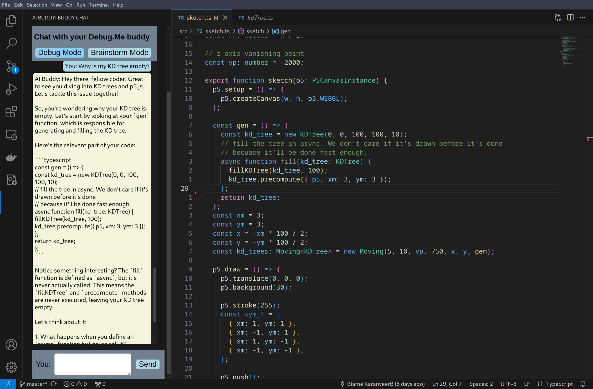

# nwHacks 2025 - Debug.Me

## Developers 
Zoe van de Vegte, Karanveer Buttar, Jun He Cui, Pan Tisapramotkul

## Description

 Debug.Me is a multi-purpose extension for Visual Studio Code, with its primary goal of helping users learn rather than just copy code. It has two modes, debug and brainstorm. Debug will read terminal errors as well as the code that was responsible for it and explain these issues in simple, understandable terms. Brainstorm is a place where users can bounce ideas off the assistant, who will guide them with questions but ultimately let the users make their own decisions. Learn while you debug! 

## Installations 

### Requirements

run <code> python pip install -r /path/to/requirements.txt </code>

### Local Models 

[place to download models](https://huggingface.co/mradermacher/starchat2-15b-v0.1-i1-GGUF)  (i1-IQ3_S or below recommended for no GPU)

## Step-to-use

1. Run `backend\app.py`
2. Open nwhacks2025\vscode-extension in new folder (root)

3. Open a folder you want the extension to help with 
4. When file run into error, message chatbot "debug" 

